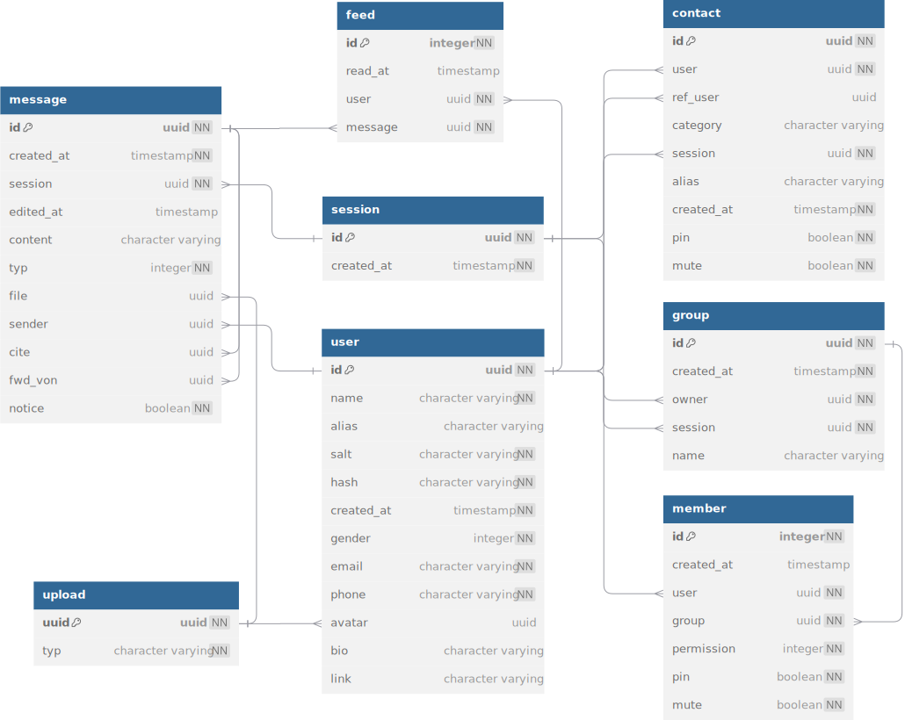

# 数据库设计

表以及表间关系从 Postgres 中导出, 利用 [dbdiagram](https://dbdiagram.io/) 生成了如下的实体和关系图.

在开发过程中, 使用了 [ORM](https://www.sea-ql.org/SeaORM/) 以降低定义表关系和编写 CRUD 语句的负担. 不过在开发中, 还是有遇到需要手工编写 SQL 查询的情况.

值得说明的是 `session`, `group`, `contact` 这 3 个表之间的关系, 为了尽可能降低复杂度, `group`, `contact` 共用 `session` 作为其会话. 用户向群聊或联系人发生消息时, 会按以下流程更新数据库:

1. `message` 表新增一条记录, 其中的 `sender` 被置为发送用户的 `id`, `session` 被设为发送到的群聊 (`group`) 或联系人 (`contact`) 所拥有的 `session`.
1. 对群聊 (`group`) 或联系人 (`contact`) 中的每个成员 (当然, 联系人的情况下只有两个成员), 在 `feed` 中注册这条消息, 即采用读扩散的方式.

数据库本身不存储用户上传的文件, 而是存储从文件内容计算的 UUID, 而文件内容以 UUID 为文件名存储在文件系统中, 好处是可以自动去重.

## 安全性

用户的密码非明文存储, 具体说, 用户注册或修改密码后随机生成长度为 30 的 ASCII 字符作为 `salt`, 从盐和密码计算 SHA256 摘要, 转换为 BASE16 后作为 `hash` 存入数据库.

用户登录后验证身份的流程为取出 `salt`, 遵循同样的方法计算摘要, 与数据库的 `hash` 做对比.

鉴权方式为 JWT, 携带用户的 `id` 与过期时间 `exp`.

## 部署

最开始使用的数据库版本是 `postgres:17.0-alpine3.20`. 后来, 因为发现 secoder 不支持配置环境变量, 容器终端对于高版本 Postgres 不可用, 因此遵循群里的建议更换为 `postgres:9.5.20-alpine`, 在容器创建后登入容器进行若干初始化操作.

在生产部署中, 数据库镜像名为 `pg-stable`, 而在集成测试与覆盖测试中, 因为 CI 环境无法访问到容器, 我使用了自己的 VPS 上的一个数据库用于测试. 为什么不采用 mock 的方法, 而是使用实际数据库呢? 原因参见 [Issue 438](https://github.com/SeaQL/sea-orm/issues/438).
