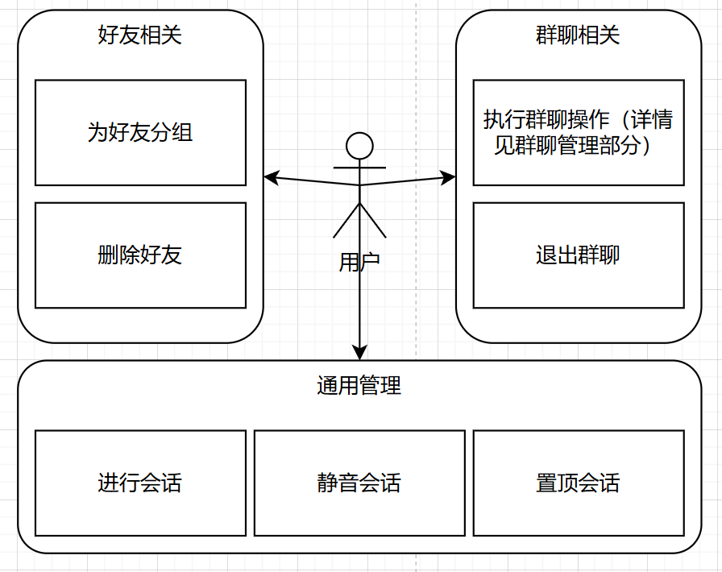
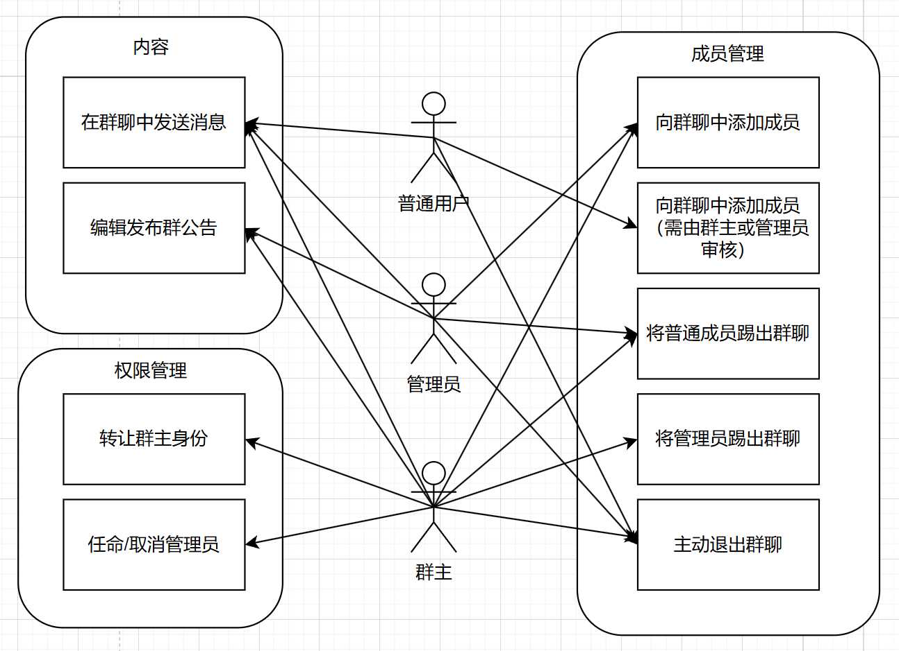
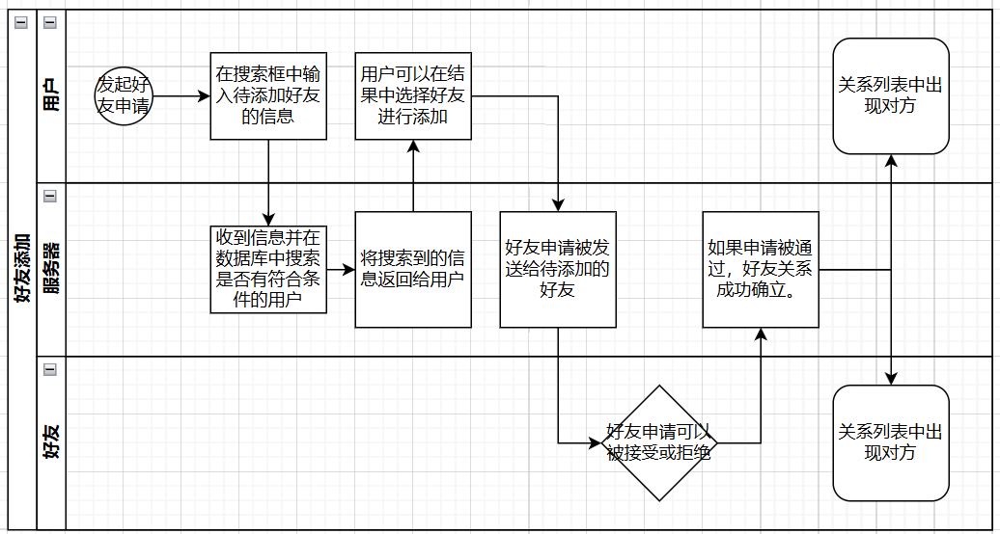
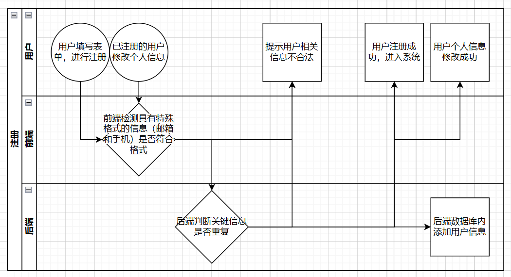

# 简介

队名 **Veloquent** 结合拉丁语 _velox_ (快速) 和 _eloquent_ (雄辩), 表达快速而清晰的沟通能力.

队伍成员包括王昱翔, 杨哲涵, 张博扬.

## 用户故事

### 账户管理

作为一名普通用户，我希望能够登录系统以与他人聊天；

作为一名普通用户，我希望我修改我账号的邮箱，手机等个人信息，以使其保持有效；

作为一名普通用户，我希望我能注销我的账号，以在我不再使用相关服务时删除我的个人信息。

### 好友关系

作为一名普通用户，我希望能够添加/接受好友以和我想要的人聊天；

作为一名普通用户，我希望能删除他人的好友，以避免不必要的打扰；

作为一名普通用户，我希望给我的好友分组，以更好地表现我和好友们的关系；

### 聊天

作为一名普通用户，我希望能够发送文本/图片/语音/视频消息，以像我的好友展现更多内容；

作为一名普通用户，我希望能与他人聊天，并及时收到信息；

作为一名普通用户，我希望聊天可以展示发送人，发送时间，以让我更充分地获知消息；

作为一名普通用户，我希望可以撤回我发送的消息，以防止误操作；

作为一名普通用户，我希望可以搜索我发送的消息，以在海量的消息中更快找到我需要的内容；

作为一名普通用户，我希望可以知悉我的消息是否被对方阅读，以更好地进行交流。

作为一名普通用户，我希望可以回复指定的消息，以避免聊天过程中的歧义。

作为一名普通用户，我希望可以置顶部分对话，以更好地接受这些对话的消息。

作为一名普通用户，我希望我可以为部分对话设置免打扰，以防止频繁的消息骚扰。

作为一名普通用户，我希望我可以转发消息，以将我与朋友的对话记录发送给其他人。

### 群聊

作为一名普通用户，我希望可以创建由我的好友组成的群聊，让更多人可以在一起聊天；

作为一名管理者，我希望可以建立多个用户的群聊并发布群公告以更好地下达工作指示；

作为群主，我希望可以分配管理员，以代替我完成群聊的部分工作；

作为群主，我希望无权限用户添加好友入群需要审核，以避免不必要的隐私泄露；

作为群主，我希望我可以将用户踢出群聊，以避免不必要的隐私泄露；

作为一名普通用户，我希望可以退出群聊，以防止我被错误地拉入群聊；

### 安全

作为一名普通用户，我希望我的隐私数据能够被安全的存储，防止泄露。

## 关键流程

### 会话管理

### 群聊管理

###  好友请求

### 用户注册及信息修改

### 分工与协作
- 杨哲涵负责了后端开发, 后端及数据库部署以及 API 文档的编写维护, 后端测试代码编写.
- 王昱翔、张博扬负责前端开发、前端部署、部分后端API测试、前端功能测试。
- 组内共同协商API设计，并根据前后端实际情况协商修改API。

